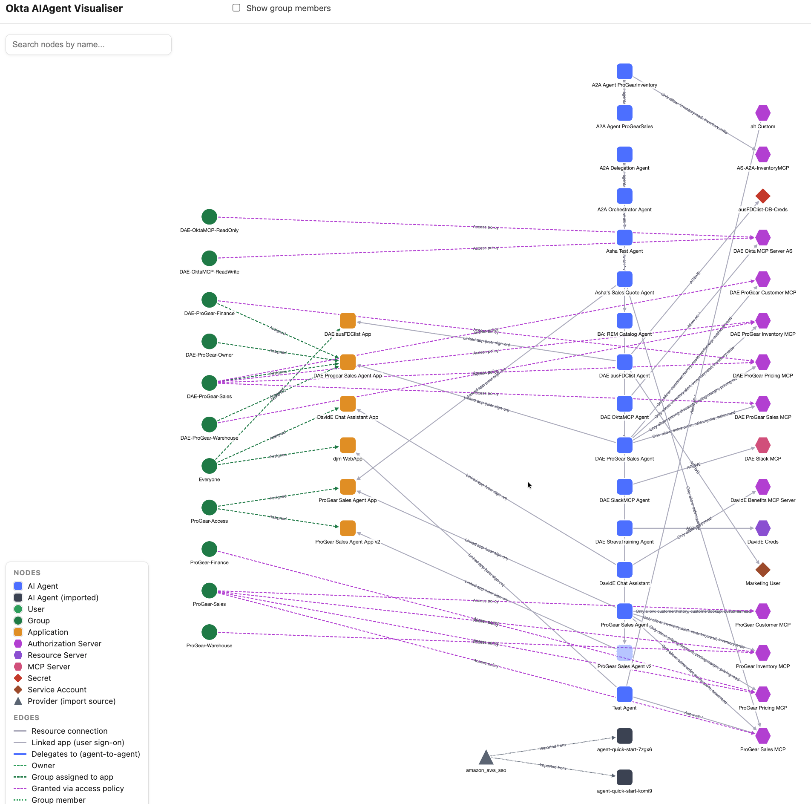
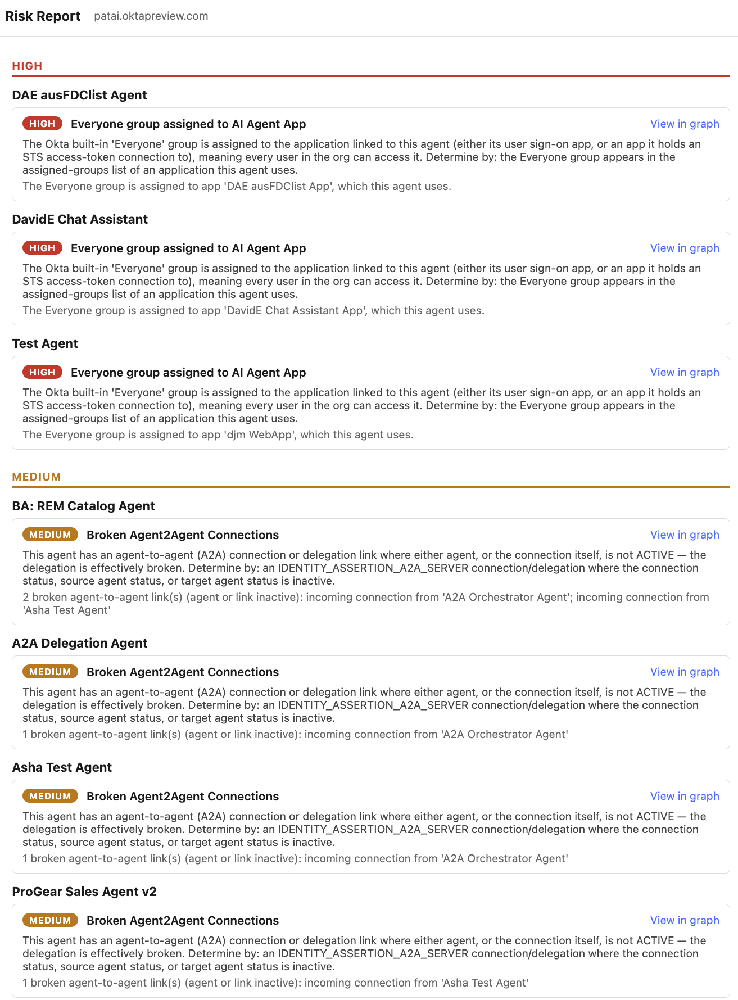

# Okta AIAgent Visualiser

An interactive entity-relationship diagram of the "AI Agents" (Okta for AI Agents / O4AA) object
graph in an Okta org: AI Agents, their owners, linked applications, resource connections
(Authorization Servers, MCP Servers, Applications, Secrets, Service Accounts), and agent-to-agent
delegations.

- Pan/zoom the graph.
- Click a node to re-center the diagram on it.
- Right-click a node (or use the "View in Okta" button in the detail panel) to open that object's
  page in the real Admin Console, in a new tab.
- Connect to any Okta org you're a super admin on — no fixed org or API token baked into the app.



## Architecture

- **Backend**: Python + FastAPI. Handles login (Authorization Code + PKCE against the org you
  connect to) and aggregates several Okta Management API calls into one graph payload.
- **Frontend**: React + Vite (TypeScript) + Cytoscape.js.
- The backend never gives the browser a raw Okta token: it holds the access/refresh token
  server-side in a session, keyed by an httpOnly cookie. The React app only ever talks to this
  backend's own `/api/*` and `/auth/*` routes.
- Vite's dev server proxies `/api`, `/auth`, and `/callback` to the backend, so the browser only
  ever sees one origin (`http://localhost:5173`) — this is what avoids CORS/Trusted-Origin
  headaches, not a permissive CORS config.

```
        ┌───────────────────────────────────────────────────────────────────┐
        │ Browser  (http://localhost:5173)                                  │
        │                                                                   │
        │ React SPA (Vite + TypeScript)                                     │
        │   OrgConnectScreen                                                │
        │   GraphScreen                                                     │
        │     Header / SearchBox / Legend                                   │
        │     CytoscapeCanvas  (layout, highlight, tap + context menu)      │
        │     DetailPanel      (node & edge details, "Open in Okta")        │
        └───────────────────────────────────────────────────────────────────┘
         │
         │  fetch /api/*  /auth/*  /callback
         │  (Vite dev-server proxy -> single origin, no CORS needed)
         ▼
        ┌───────────────────────────────────────────────────────────────────┐
        │ FastAPI backend  (http://localhost:8000)                          │
        │                                                                   │
        │ app/auth/             PKCE login, callback, session cookie        │
        │ session/store.py      in-memory, keyed by session cookie          │
        │ connections/store.py  backend/.data/connections.json (gitignored) │
        │                                                                   │
        │ app/graph/router.py    GET /api/graph, /api/groups/{id}/members   │
        │ app/graph/assemble.py  pure fn: DTOs in -> nodes/edges out        │
        │ app/okta_client/       ai_agents.py, directory.py, base.py (httpx)│
        └───────────────────────────────────────────────────────────────────┘
         │
         │  Bearer <org access token>
         ▼
        ┌───────────────────────────────────────────────────────────────────┐
        │ Your Okta org  (the org_domain you connect to)                    │
        │                                                                   │
        │ Identity / OAuth          /oauth2/v1/authorize, /token            │
        │ Core Management API       /api/v1/users, groups, apps,            │
        │                           authorizationServers                    │
        │ Workload Principals API   /workload-principals/api/v1/...         │
        └───────────────────────────────────────────────────────────────────┘
         │
         │  "Open in Okta" deep links only (Secret nodes only --
         │  Service Account has no working link, see checklist)
         ▼
        ┌───────────────────────────────────────────────────────────────────┐
        │ Okta Privileged Access (OPA)                                      │
        │ separate product/domain -- never called by the backend,           │
        │ only linked to from the browser                                   │
        └───────────────────────────────────────────────────────────────────┘
```

## Prerequisites

- Python 3.11+
- Node 18+
- An Okta org with the **Okta for AI Agents** entitlement enabled (this is currently a Beta/EA
  feature — not present in every org) and at least one AI Agent configured, to have something to
  look at.
- An OIDC app **pre-registered in that org** for this tool (Okta doesn't support fully dynamic
  arbitrary-org OAuth — the org's admin has to register a client first). See below.

## Register the OIDC app in your org

In the Admin Console of the org you want to visualize:

1. **Applications > Create App Integration**.
2. Sign-in method: **OIDC - OpenID Connect**. Application type: **Web Application** (simplest —
   lets you optionally use a client secret) or **Single-Page Application** (PKCE-only, no secret;
   also supported).
3. Grant type: **Authorization Code** (+ **Refresh Token**, so the app can silently refresh
   instead of forcing you to log in again every hour).
4. Sign-in redirect URI: `http://localhost:5173/callback`.
5. Assign the app to your own (super admin) user.
6. On the app's **Okta API Scopes** tab, grant: `okta.users.read`, `okta.groups.read`,
   `okta.apps.read`, `okta.authorizationServers.read`, `okta.aiAgents.read`.
7. Copy the **Client ID** (and **Client Secret**, if you chose Web Application).

## Running locally

Two terminals, from the repo root:

```bash
# Terminal 1 — backend
./back-start.sh

# Terminal 2 — frontend
./front-start.sh
```

Each script creates its virtualenv/`node_modules` on first run (if missing) and installs
dependencies before starting its server.

Open `http://localhost:5173`, enter your org domain and the Client ID (and secret, if any) from
above, and connect. This redirects to that org's own hosted Okta login page — you authenticate as
yourself (the admin), not as the app; the Client ID/Secret only identify the registered app, not
who's calling the API. On a successful connect, the org + Client ID/Secret are saved to
`backend/.data/connections.json` (gitignored) so next time you can just click Connect next to the
saved org instead of retyping everything.

## Running the backend tests

```bash
cd backend
source .venv/bin/activate
python -m pytest
```

The graph-assembly logic (`app/graph/assemble.py`) is a pure function tested against fixture data
in `tests/test_assemble.py` — no live org needed for that suite.

## Risk Report

A rule-based governance report over the same graph data, opened in its own browser tab. Click
**Risk Report** in the header of the graph view (or go to `/?view=risk-report` directly once
connected) — it's generated on demand, not as part of the main graph load, because one of its
rules needs an org-wide user count (see below).



Rules are evaluated as pure functions against the fetched graph data (`app/risk/rules.py`); adding
a new one is just writing another `_evaluate_...` function and appending it to `RULES` — nothing
else in the pipeline changes.

| Rule | Level | Description |
| --- | --- | --- |
| Everyone group assigned to AI Agent App | HIGH | The Okta built-in `Everyone` group is assigned to the application linked to an agent (its sign-on app, or an app it holds an `STS_ACCESS_TOKEN` connection to) — every user in the org can access it. |
| High %age of Users Assigned to AI Agent | MEDIUM | More than 80% of the org's users are assigned to an application an agent uses, approximated using the `Everyone` group's membership count as the org user-count denominator. |
| Broken Agent2Agent Connections | MEDIUM | An agent-to-agent (A2A) connection or delegation link is broken — the link itself, or one of the two agents, is not `ACTIVE`. One finding per genuinely-inactive agent, consolidating every affected counterpart (caller or callee) into a single finding rather than one per link. |
| Everyone group assigned to CAS Access Policy Rule | LOW | The `Everyone` group has a grant on an Access Policy Rule of a custom Authorization Server an agent connects to — every user in the org is covered by that policy rule. |
| Agent using secrets or service accounts | LOW | An agent has a resource connection to a vaulted secret or a service account, which typically carries broader/standing access than a scoped, agent-specific credential. |
| Inactive Downstream Components | LOW | An agent has a non-A2A resource connection (application, authorization server, secret, service account, resource/MCP server) where the connection or its resolved target is not `ACTIVE`. |
| No Owners Assigned | LOW | An agent has no owner users and no owner group assigned — no clear accountable party for its access. |

Findings are grouped by level then by agent name. Each finding has a **View in graph** link: it
posts a message back to the graph tab that opened the report (reusing that tab and closing the
report tab, rather than piling up more tabs) and calls `focusOnNode` on the specific agent the
finding is anchored on — the same agent highlighted in the finding's row, not just "an agent
involved somewhere in the chain." If the opener tab is gone (closed, or the report URL was opened
directly), it falls back to navigating to `/?focus=<agentId>` in the current tab instead.

Because the "High %age of Users" rule needs a real org user-count, generating a report does a full
sweep of the `Everyone` group's membership plus, for every app an agent uses, that app's assigned
groups' membership — on top of re-running the same agent/connection/delegation/owner fetch the
main graph does. This is a heavier set of API calls than a normal graph load, so generating a
report right after loading the graph can trip Okta's per-org rate limit (`429`) if the window
hasn't recovered yet — the client retries a few times with backoff, but a report is still best
generated a beat after the graph, not in the same instant. **Regenerate** in the report's header
re-runs this from scratch; otherwise a report is cached in-memory on the graph tab that opened it,
so reopening the report (e.g. after "View in graph" sends you back) doesn't re-pay that cost.

### Modifying or adding rules

The rules live in `backend/app/risk/rules.py`:

- A `RiskRule` dataclass (`id`, `name`, `level`, `description`, `evaluate`) — one instance per rule.
- One `_evaluate_...(ctx: RiskContext) -> list[RiskFinding]` function per rule (e.g.
  `_evaluate_everyone_on_app`, `_evaluate_broken_a2a`, `_evaluate_no_owners`) — pure logic, no I/O.
- A block of `RULE_<NAME>_ID` / `_NAME` / `_DESCRIPTION` string constants for each rule.
- The `RULES: list[RiskRule]` registry at the bottom, wiring each `_evaluate_...` function + its
  constants into a `RiskRule`.
- `evaluate_risks(ctx)` just runs every rule in `RULES` and flattens the results.

**To modify an existing rule** (e.g. change the 80% threshold in `_evaluate_high_pct_users`, or
tweak wording): edit the `_evaluate_...` function and/or its `RULE_..._DESCRIPTION` constant
directly — nothing else needs to change, and there's a matching test in
`backend/tests/test_risk_engine.py` to update alongside it.

**To add a new rule**: write a new `_evaluate_...` function, add its `ID`/`NAME`/`DESCRIPTION`
constants, append a `RiskRule(...)` to `RULES` — that's the whole registration step, by design.

**The one catch**: a new rule can only use data already present on `RiskContext`
(`backend/app/risk/context.py`) — agents, connections, delegations, groups, apps, auth servers,
app-group/policy grants, `everyone_group_id`, `org_user_count`, `app_member_user_ids`. If a rule
needs something not in there (a new Okta object type, a new field), you'd also need to extend
`_fetch_graph_context` in `backend/app/graph/router.py` (shared by both `/api/graph` and
`/api/risk-report`) and/or `backend/app/risk/router.py` to fetch and thread it through into
`RiskContext`.

Frontend needs no changes either way — `RiskReportScreen.tsx` renders `rule_name`/`level`/
`description`/`detail` generically and groups by level/agent, so any new or modified rule just
shows up.

## What v1 deliberately does not do

- **No OPA integration.** Secrets and Service Accounts render as nodes using only the fields
  already present on the AI Agent's resource connection (name/indicator, status) — there's no
  separate login to Okta Privileged Access to browse the actual vaulted-secret inventory. This
  can be added later as its own phase.
- **No org-wide user/group browsing.** The backend only ever resolves the specific
  users/groups/apps/servers that an agent's owners/connections/delegations actually reference —
  never the org-wide `/api/v1/users` or `/api/v1/groups` list endpoints. This keeps the graph fast
  regardless of total org size, but means this is not a general-purpose directory browser.
- **No hosting-specific code.** This runs on localhost only for now. The backend is a plain
  FastAPI app and the frontend is a static Vite build, so it should containerize/deploy to any
  generic host later without a rewrite — but no deployment config exists yet.

## Verify-live checklist

A few things could not be confirmed without a live tenant during development and are handled
defensively (the app degrades gracefully — omits the edge/link, logs a warning — rather than
guessing and asserting something false). Once you have this running against your test org, it's
worth confirming/fixing these:

1. ~~Owner field shape~~ — **confirmed live**: the AI Agent object itself has no `owners` field at
   all (`_extract_owners` is a defensive no-op fallback); the Admin Console's "Owners" tab is
   actually backed by a different API family entirely — the Governance API
   (`GET /governance/api/v1/resource-owners?filter=parentResourceOrn eq "{agent orn}"`), found by
   inspecting the Admin Console's own Network tab. See `app/okta_client/ai_agents.py::get_agent_owners`.
2. ~~Resource Server / MCP Server API paths~~ — **confirmed dead** against a live tenant: the
   guessed `/api/v1/resource-servers/{id}` and `/api/v1/mcp-servers/{id}` both return 405. There is
   no working by-id lookup for these two; `app/graph/assemble.py` now builds their nodes entirely
   from the `resource` object already embedded in the AI Agent connection payload (confirmed to
   carry `name`, plus `resourceUrl`/`endpointUrl`) instead. `app/okta_client/resource_servers.py`
   and `mcp_servers.py` were removed as dead code.
3. ~~Admin Console URL patterns~~ for AI Agent (`/admin/workload-principals/ai-agents/{id}/profile`),
   Resource Server (`/admin/directory/resource-servers/{id}/edit`), and MCP Server
   (`/admin/directory/mcp-servers/{id}/edit`) — **confirmed live**, wired into
   `app/graph/deeplinks.py::build_admin_url`. Secret is different: the connection's embedded
   `secret._links.web.href` is already a full, correct URL into the OPA console (a different
   product/domain), so it's used directly rather than derived from `_admin_host` — **confirmed
   live**. Service Account's equivalent embedded link (`serviceAccount._links.web.href`) is
   **confirmed live to be dead** (404 — `/t/{tenant}/saas_apps/{appId}/service_accounts/{id}`); the
   real OPA console URL needs a `resourceGroupId`/`projectId` that never appears in the AI Agent
   connection payload, and fetching those would require a second OAuth login scoped to the OPA API
   (a separate product from core Okta Management API) — deliberately not pursued for this minor
   case, so Service Account nodes have no deep link. Still unconfirmed: Provider.
4. ~~Service Account connection shape~~ — label extraction **confirmed live**, identical to
   `STS_VAULT_SECRET`: an embedded `serviceAccount` object with `name`. Its `_links.web.href` is
   confirmed dead — see item 3.
5. **Application deep link's app-type key** — the link builder assumes `GET /api/v1/apps/{id}`'s
   `name` field supplies the catalog key the Admin Console URL needs (e.g. `oidc_client`). Confirm
   this holds for both OIN app instances and any custom app types in your org.
6. **Custom-domain orgs** — the admin-console-host derivation
   (`app/graph/deeplinks.py::_admin_host`) assumes the org domain you enter is its native
   `*.okta.com`/`*.oktapreview.com` domain. If your org uses a vanity custom domain, that
   derivation needs a different approach.
7. **`_is_inactive` status heuristic** (`app/risk/rules.py`) — treats any status other than
   `ACTIVE`/`UNKNOWN`/`None` as inactive for the Risk Report's "Broken A2A" and "Inactive
   Downstream" rules. Confirm this matches the actual status values Okta returns for agents, apps,
   auth servers, and connections in your org (e.g. `SUSPENDED`, `DEPROVISIONED`, `INACTIVE`).
8. **Everyone group lookup's `BUILT_IN` filter** (`app/okta_client/directory.py::find_everyone_group`)
   — assumes `GET /api/v1/groups?filter=type eq "BUILT_IN"&limit=1` uniquely and reliably returns
   the org's built-in Everyone group as the first (only) result. Confirm this against a live tenant;
   if an org has other `BUILT_IN` groups or none at all, the Risk Report's "Everyone → App",
   "Everyone → Policy", and "High % of users" rules will silently skip (with a warning) rather than
   misfire.

## Repo

Private repo. Code here talks to live Okta admin APIs for whichever org you connect it to — don't
commit org domains, client secrets, or tokens; the `.gitignore` excludes `.env` files, but always
double-check `git status`/`git diff` before committing regardless.
